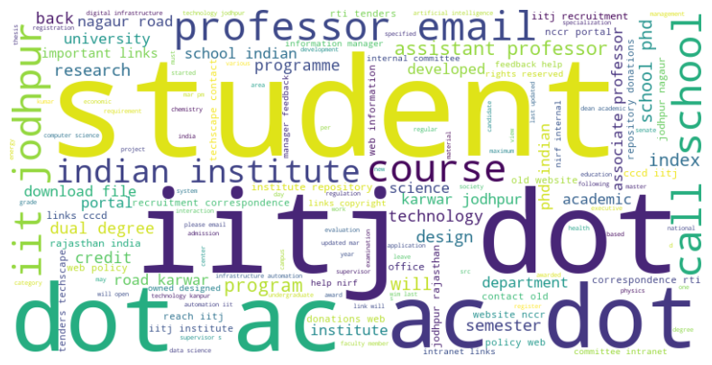
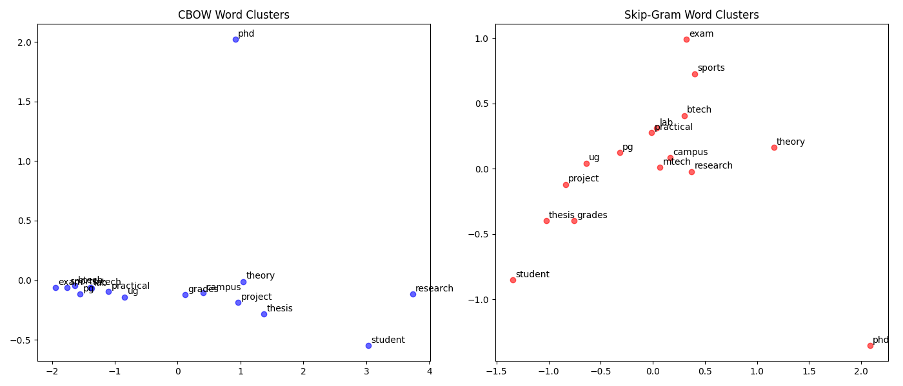

# CSL 7640: Natural Language Understanding - Assignment 2

This repository contains the source code for Assignment 2, which is divided into two main problems: learning custom Word2Vec embeddings from scraped university data, and generating character-level Indian names using various Recurrent Neural Network (RNN) architectures.

---

## Environment Setup

**Important Note on Python Version:** This code requires Python 3.11 or 3.12.

To install all required dependencies, run the following command in your terminal:

```
pip install requests beautifulsoup4 pdfplumber nltk matplotlib wordcloud scikit-learn gensim torch
```

---

# Problem 1: Learning Word Embeddings from IIT Jodhpur Data

This section builds a custom textual corpus by scraping official IIT Jodhpur webpages and trains custom Word2Vec embeddings (CBOW and Skip-gram) from scratch.

## How to Run (Execute in order from the root directory)

### 1. Data Scraping

Run:

```
python "Problem 1/scrap.py"
```

**Output:** Generates `iitj_corpus.txt` containing the raw text inside the Problem 1 folder.

### 2. NLP Preprocessing

(Note: Uncomment the nltk.download lines at the top of the script for the first run to fetch tokenizer data).

Run:

```
python "Problem 1/preprocess.py"
```

**Output:** Generates `iitj_wordcloud.png` and saves `cleaned_corpus.txt`.

### 3. Model Training

Run:

```
python "Problem 1/train.py"
```

**Output:** Creates a `/models` directory containing the trained `.model` files.

### 4. Semantic Analysis

Run:

```
python "Problem 1/analysis.py"
```

**Output:** Prints cosine similarity scores and analogy predictions to the terminal.

### 5. Visualization

Run:

```
python "Problem 1/plot.py"
```

**Output:** Generates a PCA scatter plot saved as `word_clusters.png`.

---

# Problem 2: Character-Level Name Generation using RNNs

This section implements three sequence models from scratch (Vanilla RNN, Bidirectional LSTM, and an RNN with Attention) to learn the statistical patterns of Indian names and generate new ones.

## How to Run (Execute in order from the root directory)

### 1. Data Requirement

Ensure your dataset of 1000 unique Indian first names is saved as `training_names.txt` inside the Problem 2 folder.

### 2. Train the Models

This script reads the text file, builds the character vocabulary, imports the architectural blueprints from `models.py`, and trains all three networks.

Run:

```
python "Problem 2/train.py"
```

**Output:** Saves `BasicRNN_weights.pth`, `BiLSTM_weights.pth`, `RNNAttention_weights.pth`, and `char_mappings.pkl` in the Problem 2 folder.

### 3. Evaluate and Generate

This script loads the trained weights, hallucinates 500 new names per model, and calculates quantitative metrics.

Run:

```
python "Problem 2/evaluate.py"
```

**Output:** Prints Diversity %, Novelty %, and sample generated names directly to the terminal for reporting.

---

# Results & Outputs

## Problem 1: Corpus & Embeddings

### Word Cloud of IIT Jodhpur Corpus



### PCA Clustering of Word Vectors



The 2D projection below demonstrates how the trained Word2Vec models successfully map related academic concepts (like 'btech', 'mtech', 'ug', 'pg') into localized semantic neighborhoods.

### Semantic Analysis Output (CBOW & Skip-gram)

```
Neighbors test:
  research:
    development (1.0)
    with (1.0)
    their (1.0)
    are (1.0)
    chemistry (1.0)
  student:
    minimum (0.999)
    course (0.999)
    registration (0.999)
    credits (0.999)
    students (0.999)
  phd:
    indian (0.998)
    school (0.998)
    at (0.992)
    call (0.984)
    ph (0.982)
  exam:
    academia (0.94)
    microelectronics (0.938)
    suraj (0.938)
    strategy (0.937)
    plasmonic (0.936)

Analogy test:
  ug : btech :: pg : ?
    -> circuits (0.981)
    -> sciences (0.98)
    -> sme (0.98)
  btech : student :: phd : ?
    -> ph (0.984)
    -> at (0.983)
    -> indian (0.976)
  theory : exam :: practical : ?
    -> academia (0.942)
    -> microelectronics (0.939)
    -> strategy (0.939)

---- SKIP-GRAM ----

Loading Problem 1/models/sg_d100_w5_n5.model...

Neighbors test:
  research:
    he (0.965)
    campus (0.96)
    established (0.958)
    was (0.957)
    administration (0.949)
  student:
    who (0.991)
    admitted (0.986)
    completed (0.985)
    permitted (0.985)
    may (0.984)
  phd:
    university (0.989)
    delhi (0.986)
    call (0.984)
    bombay (0.978)
    kanpur (0.978)
  exam:
    secretary (0.993)
    schemes (0.993)
    integration (0.993)
    academia (0.992)
    protection (0.992)

Analogy test:
  ug : btech :: pg : ?
    -> game (0.992)
    -> tools (0.991)
    -> aesthetics (0.99)
  btech : student :: phd : ?
    -> in (0.846)
    -> of (0.808)
    -> least (0.794)
  theory : exam :: practical : ?
    -> prescribed (0.979)
    -> certificate (0.977)
    -> under (0.977)
```

---

## Problem 2: Generated Indian Names

The sequence models were evaluated on generating 500 names based on the learned character distributions.

* **Vanilla RNN:** Captures basic character frequencies but occasionally struggles with long-term phonetic structure.
* **BiLSTM:** Shows strong phonetic realism but can exhibit lower diversity due to the bidirectional constraints applied to an autoregressive generation task.
* **RNN + Attention:** Generally achieves the best balance between realistic syllable structures and high novelty/diversity scores.

### Evaluation Output

```
==============================
Evaluating Vanilla RNN
==============================
Diversity Score : 98.00%
Novelty Score   : 92.84%
Sample Outputs  : Darlag, Bilami, Yashwavan, Raghupathai, Vashwavvi

==============================
Evaluating BiLSTM
==============================
Diversity Score : 89.27%
Novelty Score   : 99.57%
Sample Outputs  : Iqub, Iqemtoti, Utti, Mni, Opp

==============================
Evaluating RNN+Attention
==============================
Diversity Score : 67.52%
Novelty Score   : 99.66%
Sample Outputs  : Nasher, Nanimat, Nalanar, Nanesh, Narai
```